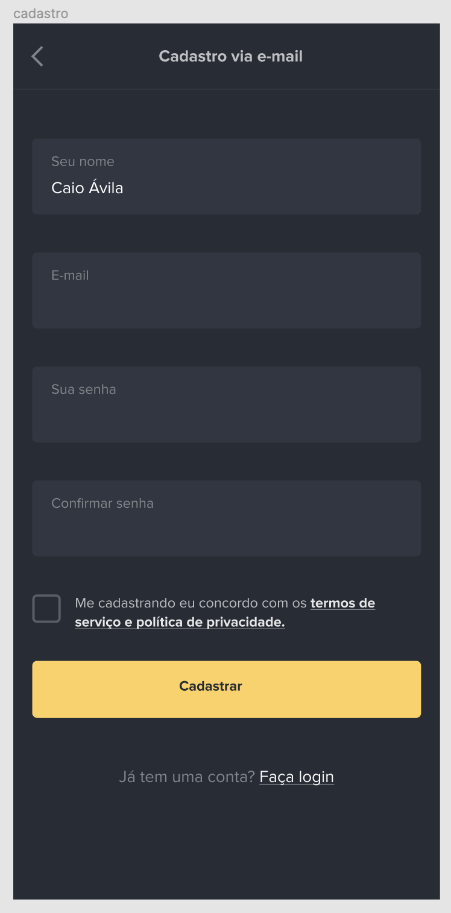
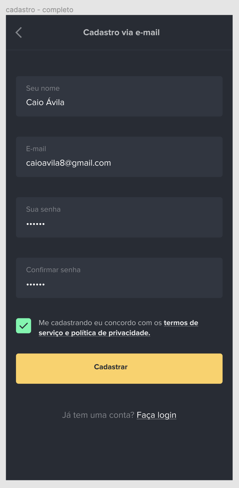
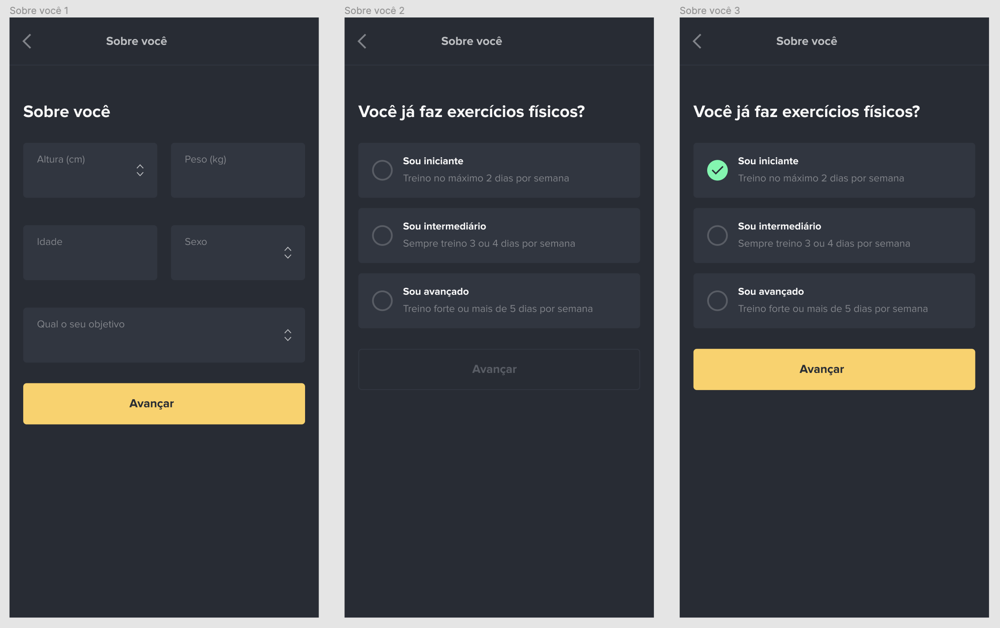
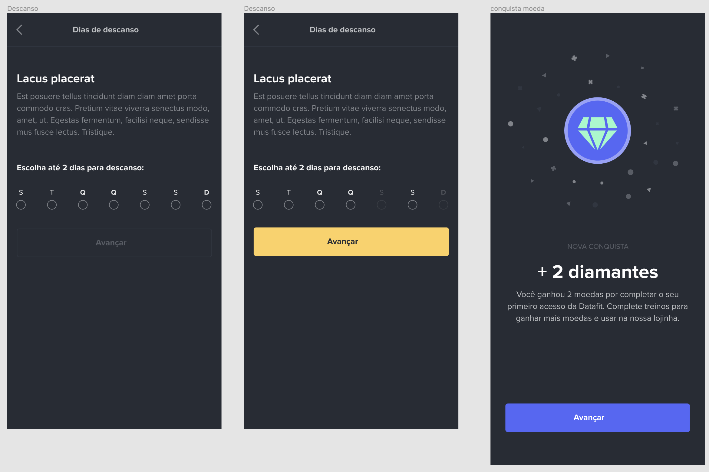

# DataFit Android app

DataFit was a side project that I was involved in last year, and I have decided to open source it so that I can add to my portfolio a prove that I know how to build an Android app written in Kotlin.

DataFit Android app is a mobile application written in Kotlin and this project contains the welcome views, sign up and sign in flows.

- [DataFit Android app](#datafit-android-app)
  - [Screens](#screens)
    - [Welcome](#welcome)
  - [Overall architecture](#overall-architecture)

# DataFit Android app

## Screens

### Welcome

### Login

### Sign up

## Overall architecture

TBD
